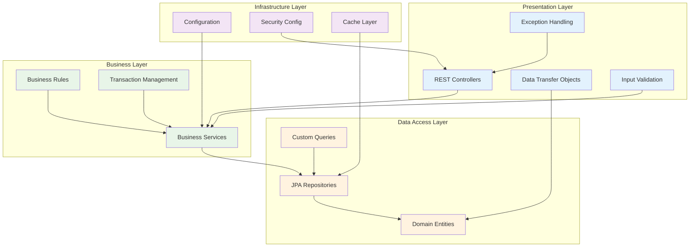
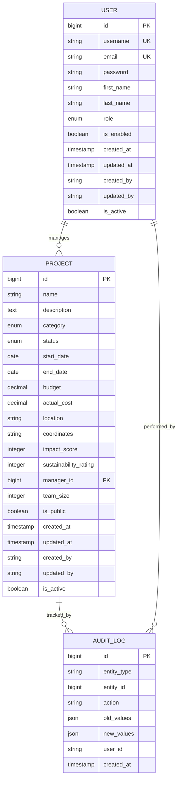
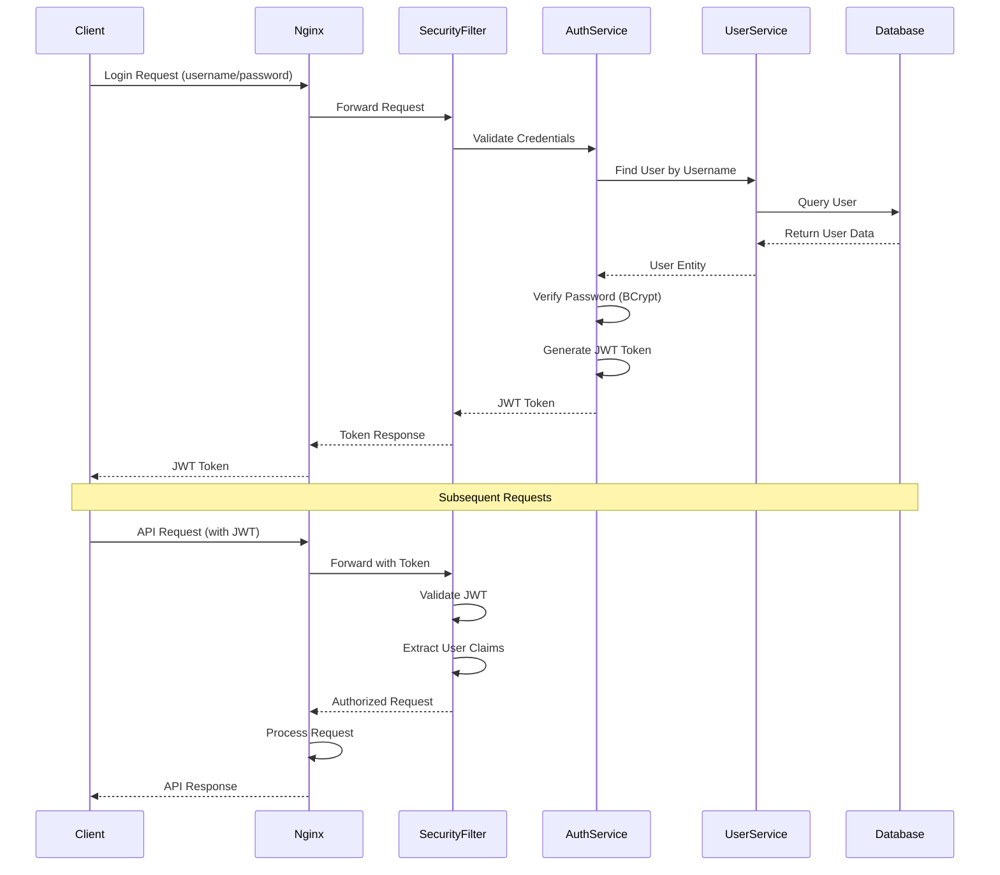

# Application Architecture Diagrams

## Layered Architecture Detail



## Domain Model Relationships



## Request Processing Flow

```mermaid
flowchart TD
    START([HTTP Request]) --> NGINX[Nginx Proxy]
    NGINX --> SECURITY{Authentication<br/>Required?}
    
    SECURITY -->|Yes| JWT[JWT Validation]
    SECURITY -->|No| CONTROLLER[Controller Layer]
    
    JWT -->|Valid| CONTROLLER
    JWT -->|Invalid| UNAUTHORIZED[401 Unauthorized]
    
    CONTROLLER --> VALIDATE[Input Validation]
    VALIDATE -->|Valid| SERVICE[Service Layer]
    VALIDATE -->|Invalid| BAD_REQUEST[400 Bad Request]
    
    SERVICE --> BUSINESS[Business Logic]
    BUSINESS --> REPOSITORY[Repository Layer]
    
    REPOSITORY --> CACHE{Cache Check}
    CACHE -->|Hit| CACHE_DATA[Return Cached Data]
    CACHE -->|Miss| DATABASE[Database Query]
    
    DATABASE --> UPDATE_CACHE[Update Cache]
    UPDATE_CACHE --> RESPONSE[Build Response]
    CACHE_DATA --> RESPONSE
    
    RESPONSE --> DTO[DTO Transformation]
    DTO --> JSON[JSON Response]
    JSON --> CLIENT[Client]
    
    UNAUTHORIZED --> CLIENT
    BAD_REQUEST --> CLIENT
    
    classDef start fill:#e8f5e8
    classDef process fill:#e3f2fd
    classDef decision fill:#fff3e0
    classDef error fill:#ffebee
    classDef end fill:#f3e5f5
    
    class START start
    class NGINX,CONTROLLER,SERVICE,REPOSITORY,DATABASE,RESPONSE,DTO,JSON process
    class SECURITY,VALIDATE,CACHE decision
    class UNAUTHORIZED,BAD_REQUEST error
    class CLIENT end
```

## Security Architecture Flow


