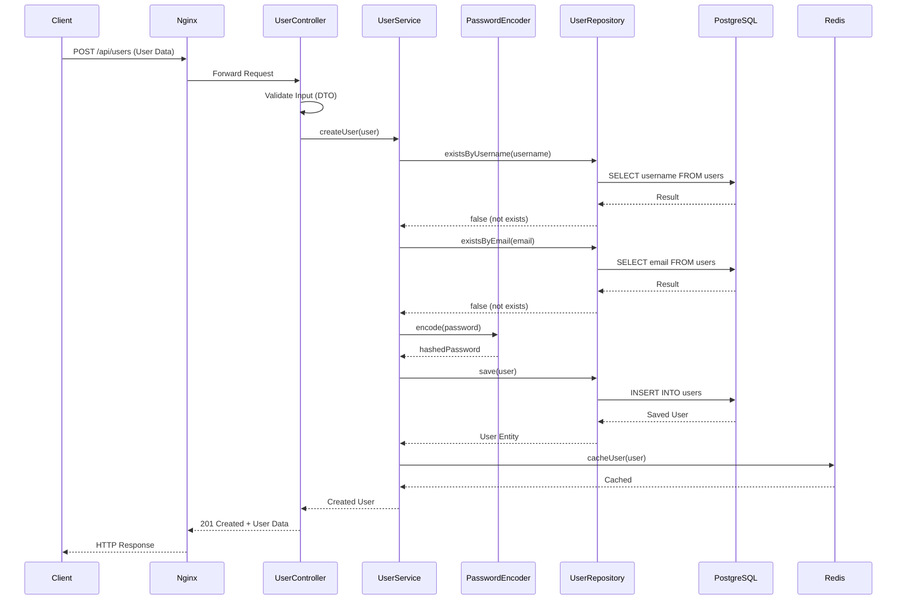
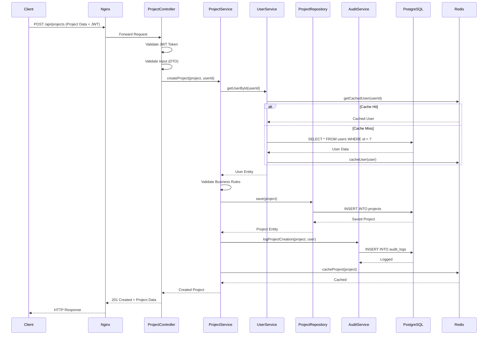
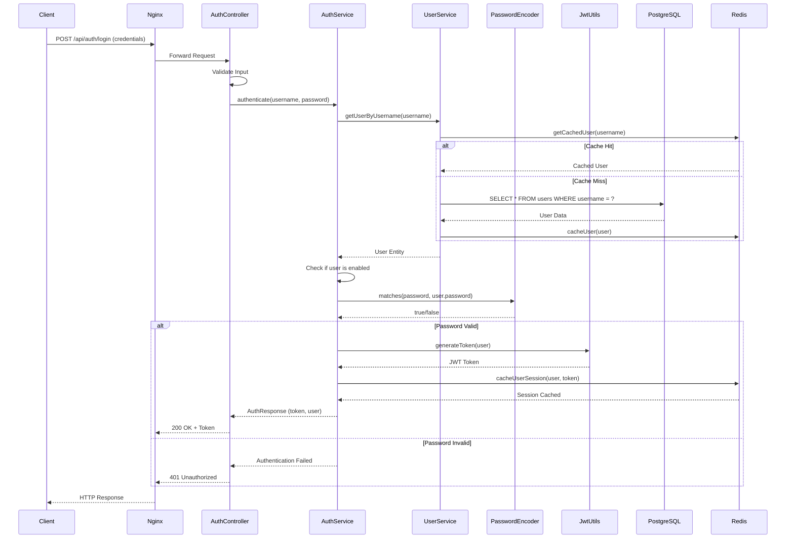
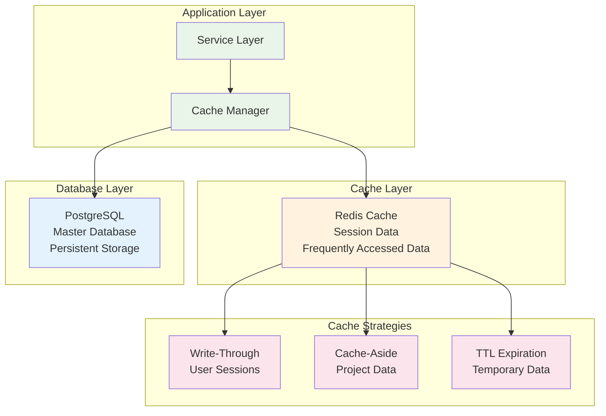
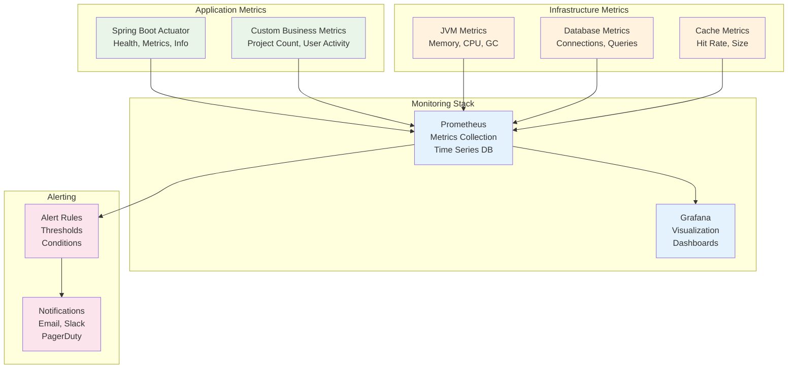

# Data Flow Architecture Diagrams

## User Registration Flow



## Project Creation Flow



## Authentication Flow



## Data Synchronization Flow



## Error Handling Flow

```mermaid
flowchart TD
    START([Request]) --> CONTROLLER[Controller]
    CONTROLLER --> VALIDATION{Input Valid?}
    
    VALIDATION -->|No| VALIDATION_ERROR[ValidationException]
    VALIDATION -->|Yes| SERVICE[Service Layer]
    
    SERVICE --> BUSINESS_LOGIC{Business Rules<br/>Valid?}
    BUSINESS_LOGIC -->|No| BUSINESS_ERROR[BusinessException]
    BUSINESS_LOGIC -->|Yes| REPOSITORY[Repository]
    
    REPOSITORY --> DATABASE{Database<br/>Operation}
    DATABASE -->|Success| SUCCESS[Success Response]
    DATABASE -->|Constraint Violation| CONSTRAINT_ERROR[DataIntegrityException]
    DATABASE -->|Connection Error| CONNECTION_ERROR[DataAccessException]
    DATABASE -->|Not Found| NOT_FOUND[EntityNotFoundException]
    
    VALIDATION_ERROR --> GLOBAL_HANDLER[GlobalExceptionHandler]
    BUSINESS_ERROR --> GLOBAL_HANDLER
    CONSTRAINT_ERROR --> GLOBAL_HANDLER
    CONNECTION_ERROR --> GLOBAL_HANDLER
    NOT_FOUND --> GLOBAL_HANDLER
    
    GLOBAL_HANDLER --> LOG_ERROR[Log Error]
    LOG_ERROR --> STRUCTURED_RESPONSE[Structured Error Response]
    STRUCTURED_RESPONSE --> CLIENT[Client]
    
    SUCCESS --> CLIENT
    
    classDef start fill:#e8f5e8
    classDef process fill:#e3f2fd
    classDef decision fill:#fff3e0
    classDef error fill:#ffebee
    classDef success fill:#e8f5e8
    classDef end fill:#f3e5f5
    
    class START start
    class CONTROLLER,SERVICE,REPOSITORY process
    class VALIDATION,BUSINESS_LOGIC,DATABASE decision
    class VALIDATION_ERROR,BUSINESS_ERROR,CONSTRAINT_ERROR,CONNECTION_ERROR,NOT_FOUND error
    class SUCCESS success
    class GLOBAL_HANDLER,LOG_ERROR,STRUCTURED_RESPONSE,CLIENT end
```

## Monitoring Data Flow


