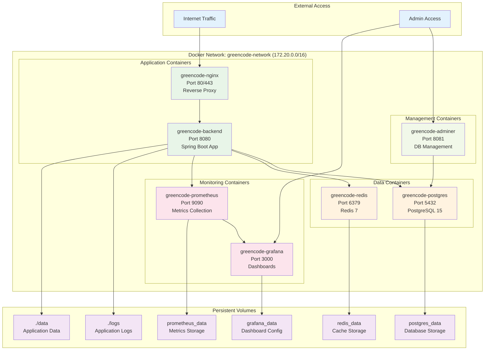
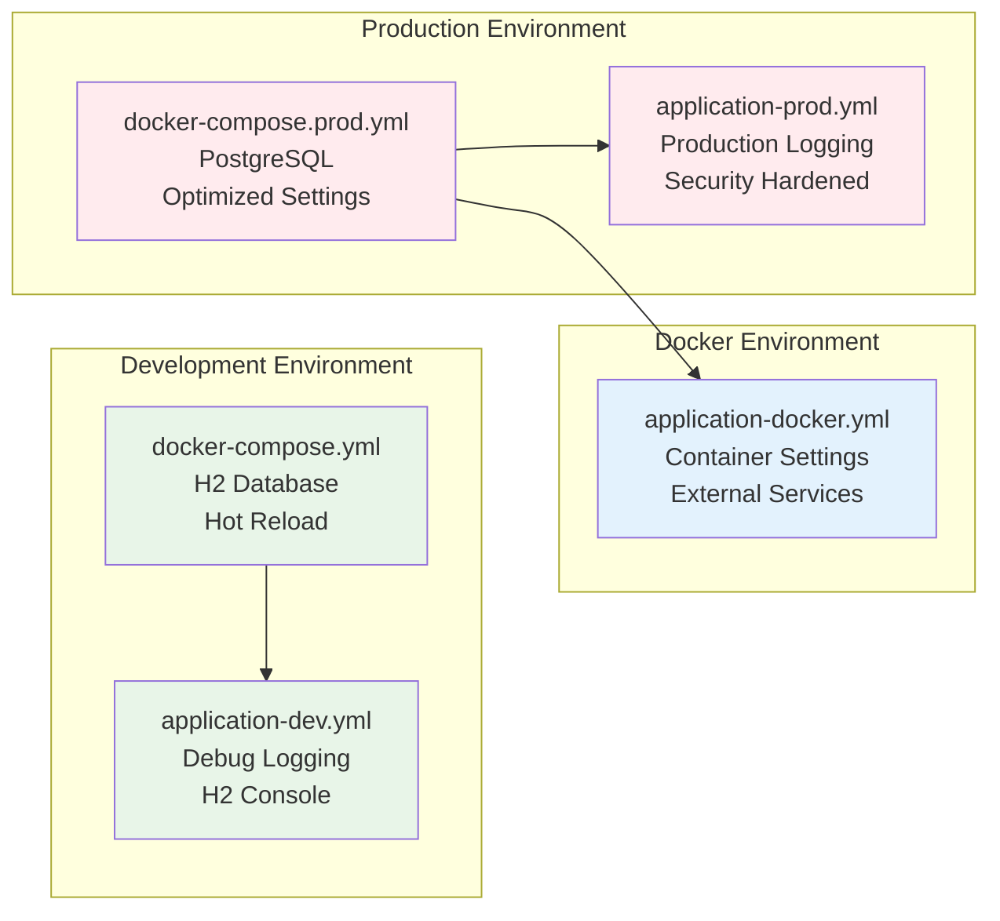
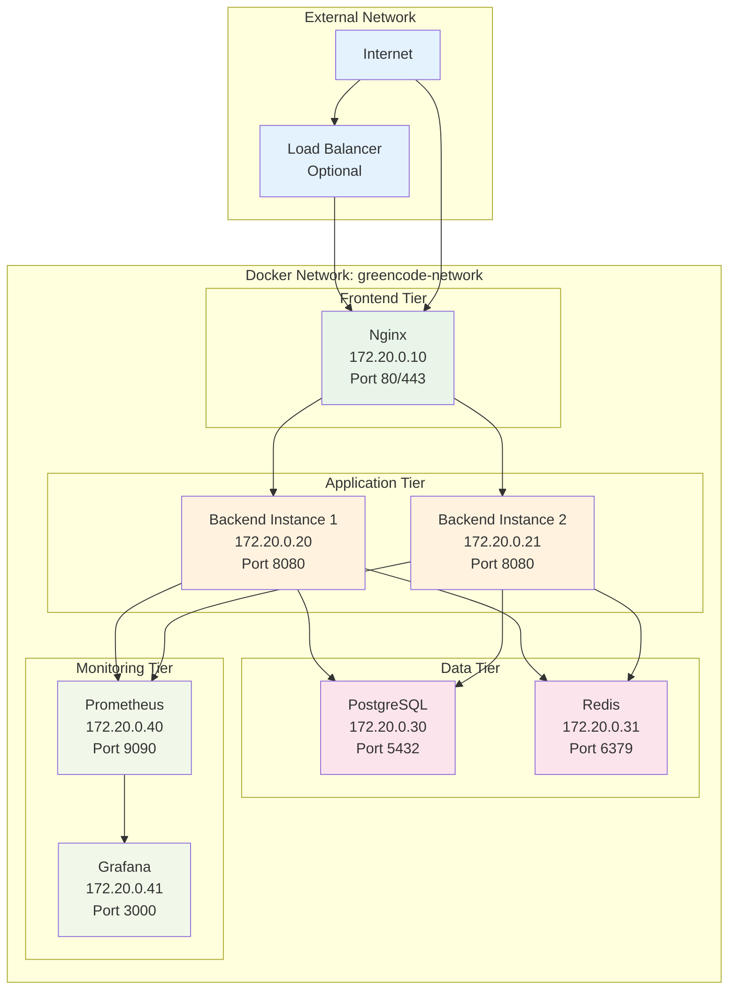
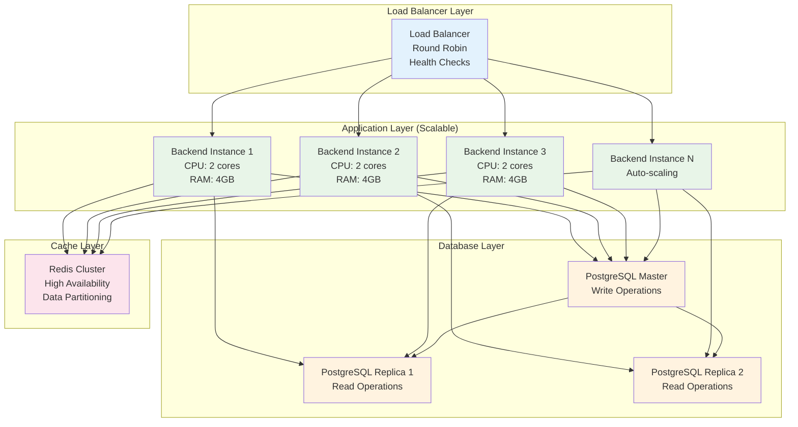
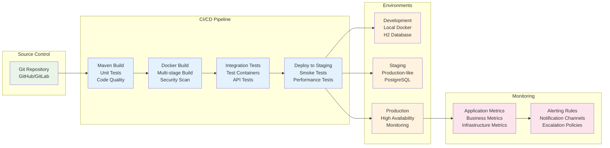

# Deployment Architecture Diagrams

## Docker Container Architecture

```mermaid
graph TB
    subgraph "Docker Network: greencode-network (172.20.0.0/16)"
        subgraph "Application Containers"
            BACKEND[greencode-backend<br/>Port 8080<br/>Spring Boot App]
            NGINX[greencode-nginx<br/>Port 80/443<br/>Reverse Proxy]
        end
        
        subgraph "Data Containers"
            POSTGRES[greencode-postgres<br/>Port 5432<br/>PostgreSQL 15]
            REDIS[greencode-redis<br/>Port 6379<br/>Redis 7]
        end
        
        subgraph "Monitoring Containers"
            PROMETHEUS[greencode-prometheus<br/>Port 9090<br/>Metrics Collection]
            GRAFANA[greencode-grafana<br/>Port 3000<br/>Dashboards]
        end
        
        subgraph "Management Containers"
            ADMINER[greencode-adminer<br/>Port 8081<br/>DB Management]
        end
    end
    
    subgraph "External Access"
        INTERNET[Internet Traffic]
        ADMIN[Admin Access]
    end
    
    subgraph "Persistent Volumes"
        POSTGRES_DATA[postgres_data<br/>Database Storage]
        REDIS_DATA[redis_data<br/>Cache Storage]
        PROMETHEUS_DATA[prometheus_data<br/>Metrics Storage]
        GRAFANA_DATA[grafana_data<br/>Dashboard Config]
        APP_LOGS[./logs<br/>Application Logs]
        APP_DATA[./data<br/>Application Data]
    end
    
    INTERNET --> NGINX
    ADMIN --> ADMINER
    ADMIN --> GRAFANA
    
    NGINX --> BACKEND
    BACKEND --> POSTGRES
    BACKEND --> REDIS
    BACKEND --> PROMETHEUS
    
    PROMETHEUS --> GRAFANA
    ADMINER --> POSTGRES
    
    POSTGRES --> POSTGRES_DATA
    REDIS --> REDIS_DATA
    PROMETHEUS --> PROMETHEUS_DATA
    GRAFANA --> GRAFANA_DATA
    BACKEND --> APP_LOGS
    BACKEND --> APP_DATA
    
    classDef app fill:#e8f5e8
    classDef data fill:#fff3e0
    classDef monitor fill:#fce4ec
    classDef tools fill:#f1f8e9
    classDef external fill:#e3f2fd
    classDef storage fill:#f3e5f5
    
    class BACKEND,NGINX app
    class POSTGRES,REDIS data
    class PROMETHEUS,GRAFANA monitor
    class ADMINER tools
    class INTERNET,ADMIN external
    class POSTGRES_DATA,REDIS_DATA,PROMETHEUS_DATA,GRAFANA_DATA,APP_LOGS,APP_DATA storage
```

## Environment Configuration

```mermaid
graph LR
    subgraph "Development Environment"
        DEV_COMPOSE[docker-compose.yml<br/>H2 Database<br/>Hot Reload]
        DEV_CONFIG[application-dev.yml<br/>Debug Logging<br/>H2 Console]
    end
    
    subgraph "Production Environment"
        PROD_COMPOSE[docker-compose.prod.yml<br/>PostgreSQL<br/>Optimized Settings]
        PROD_CONFIG[application-prod.yml<br/>Production Logging<br/>Security Hardened]
    end
    
    subgraph "Docker Environment"
        DOCKER_CONFIG[application-docker.yml<br/>Container Settings<br/>External Services]
    end
    
    DEV_COMPOSE --> DEV_CONFIG
    PROD_COMPOSE --> PROD_CONFIG
    PROD_COMPOSE --> DOCKER_CONFIG
    
    classDef dev fill:#e8f5e8
    classDef prod fill:#ffebee
    classDef docker fill:#e3f2fd
    
    class DEV_COMPOSE,DEV_CONFIG dev
    class PROD_COMPOSE,PROD_CONFIG prod
    class DOCKER_CONFIG docker
```

## Network Architecture

```mermaid
graph TB
    subgraph "External Network"
        INTERNET[Internet]
        LOAD_BALANCER[Load Balancer<br/>Optional]
    end
    
    subgraph "Docker Network: greencode-network"
        subgraph "Frontend Tier"
            NGINX[Nginx<br/>172.20.0.10<br/>Port 80/443]
        end
        
        subgraph "Application Tier"
            BACKEND1[Backend Instance 1<br/>172.20.0.20<br/>Port 8080]
            BACKEND2[Backend Instance 2<br/>172.20.0.21<br/>Port 8080]
        end
        
        subgraph "Data Tier"
            POSTGRES[PostgreSQL<br/>172.20.0.30<br/>Port 5432]
            REDIS[Redis<br/>172.20.0.31<br/>Port 6379]
        end
        
        subgraph "Monitoring Tier"
            PROMETHEUS[Prometheus<br/>172.20.0.40<br/>Port 9090]
            GRAFANA[Grafana<br/>172.20.0.41<br/>Port 3000]
        end
    end
    
    INTERNET --> LOAD_BALANCER
    LOAD_BALANCER --> NGINX
    INTERNET --> NGINX
    
    NGINX --> BACKEND1
    NGINX --> BACKEND2
    
    BACKEND1 --> POSTGRES
    BACKEND1 --> REDIS
    BACKEND2 --> POSTGRES
    BACKEND2 --> REDIS
    
    BACKEND1 --> PROMETHEUS
    BACKEND2 --> PROMETHEUS
    PROMETHEUS --> GRAFANA
    
    classDef external fill:#e3f2fd
    classDef frontend fill:#e8f5e8
    classDef app fill:#fff3e0
    classDef data fill:#fce4ec
    classDef monitor fill:#f1f8e9
    
    class INTERNET,LOAD_BALANCER external
    class NGINX frontend
    class BACKEND1,BACKEND2 app
    class POSTGRES,REDIS data
    class PROMETHEUS,GRAFANA monitor
```

## Scaling Architecture

```mermaid
graph TB
    subgraph "Load Balancer Layer"
        LB[Load Balancer<br/>Round Robin<br/>Health Checks]
    end
    
    subgraph "Application Layer (Scalable)"
        APP1[Backend Instance 1<br/>CPU: 2 cores<br/>RAM: 4GB]
        APP2[Backend Instance 2<br/>CPU: 2 cores<br/>RAM: 4GB]
        APP3[Backend Instance 3<br/>CPU: 2 cores<br/>RAM: 4GB]
        APP_N[Backend Instance N<br/>Auto-scaling]
    end
    
    subgraph "Database Layer"
        POSTGRES_MASTER[PostgreSQL Master<br/>Write Operations]
        POSTGRES_REPLICA1[PostgreSQL Replica 1<br/>Read Operations]
        POSTGRES_REPLICA2[PostgreSQL Replica 2<br/>Read Operations]
    end
    
    subgraph "Cache Layer"
        REDIS_CLUSTER[Redis Cluster<br/>High Availability<br/>Data Partitioning]
    end
    
    LB --> APP1
    LB --> APP2
    LB --> APP3
    LB --> APP_N
    
    APP1 --> POSTGRES_MASTER
    APP1 --> POSTGRES_REPLICA1
    APP1 --> REDIS_CLUSTER
    
    APP2 --> POSTGRES_MASTER
    APP2 --> POSTGRES_REPLICA2
    APP2 --> REDIS_CLUSTER
    
    APP3 --> POSTGRES_MASTER
    APP3 --> POSTGRES_REPLICA1
    APP3 --> REDIS_CLUSTER
    
    APP_N --> POSTGRES_MASTER
    APP_N --> POSTGRES_REPLICA2
    APP_N --> REDIS_CLUSTER
    
    POSTGRES_MASTER --> POSTGRES_REPLICA1
    POSTGRES_MASTER --> POSTGRES_REPLICA2
    
    classDef lb fill:#e3f2fd
    classDef app fill:#e8f5e8
    classDef db fill:#fff3e0
    classDef cache fill:#fce4ec
    
    class LB lb
    class APP1,APP2,APP3,APP_N app
    class POSTGRES_MASTER,POSTGRES_REPLICA1,POSTGRES_REPLICA2 db
    class REDIS_CLUSTER cache
```

## CI/CD Pipeline Architecture

```mermaid
flowchart LR
    subgraph "Source Control"
        GIT[Git Repository<br/>GitHub/GitLab]
    end
    
    subgraph "CI/CD Pipeline"
        BUILD[Maven Build<br/>Unit Tests<br/>Code Quality]
        CONTAINER[Docker Build<br/>Multi-stage Build<br/>Security Scan]
        TEST[Integration Tests<br/>Test Containers<br/>API Tests]
        DEPLOY[Deploy to Staging<br/>Smoke Tests<br/>Performance Tests]
    end
    
    subgraph "Environments"
        DEV[Development<br/>Local Docker<br/>H2 Database]
        STAGING[Staging<br/>Production-like<br/>PostgreSQL]
        PROD[Production<br/>High Availability<br/>Monitoring]
    end
    
    subgraph "Monitoring"
        METRICS[Application Metrics<br/>Business Metrics<br/>Infrastructure Metrics]
        ALERTS[Alerting Rules<br/>Notification Channels<br/>Escalation Policies]
    end
    
    GIT --> BUILD
    BUILD --> CONTAINER
    CONTAINER --> TEST
    TEST --> DEPLOY
    
    DEPLOY --> DEV
    DEPLOY --> STAGING
    DEPLOY --> PROD
    
    PROD --> METRICS
    METRICS --> ALERTS
    
    classDef source fill:#e8f5e8
    classDef pipeline fill:#e3f2fd
    classDef env fill:#fff3e0
    classDef monitor fill:#fce4ec
    
    class GIT source
    class BUILD,CONTAINER,TEST,DEPLOY pipeline
    class DEV,STAGING,PROD env
    class METRICS,ALERTS monitor
```
