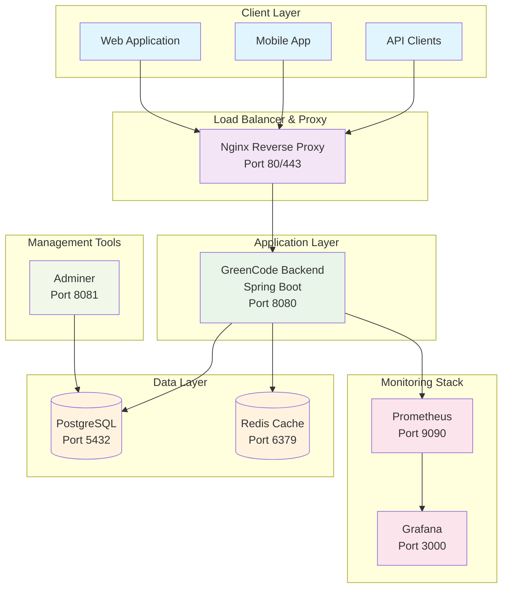
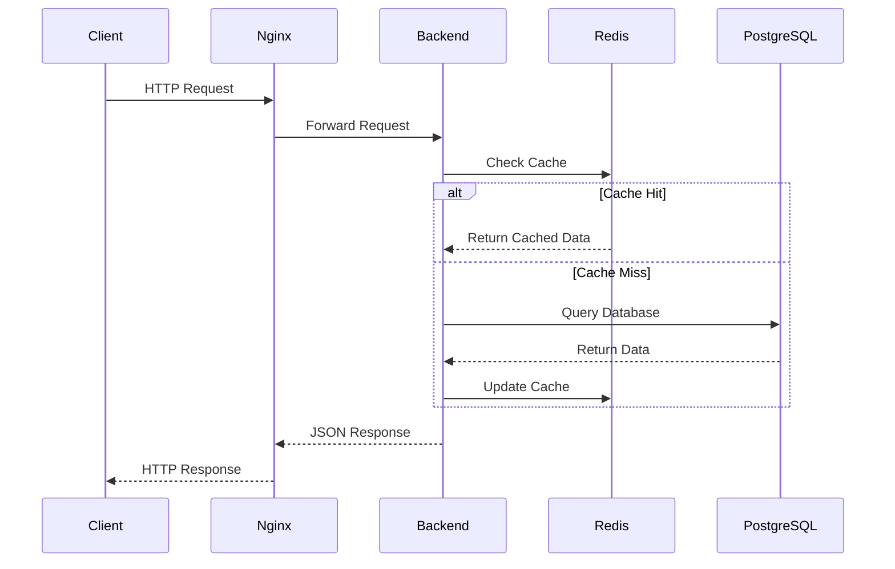
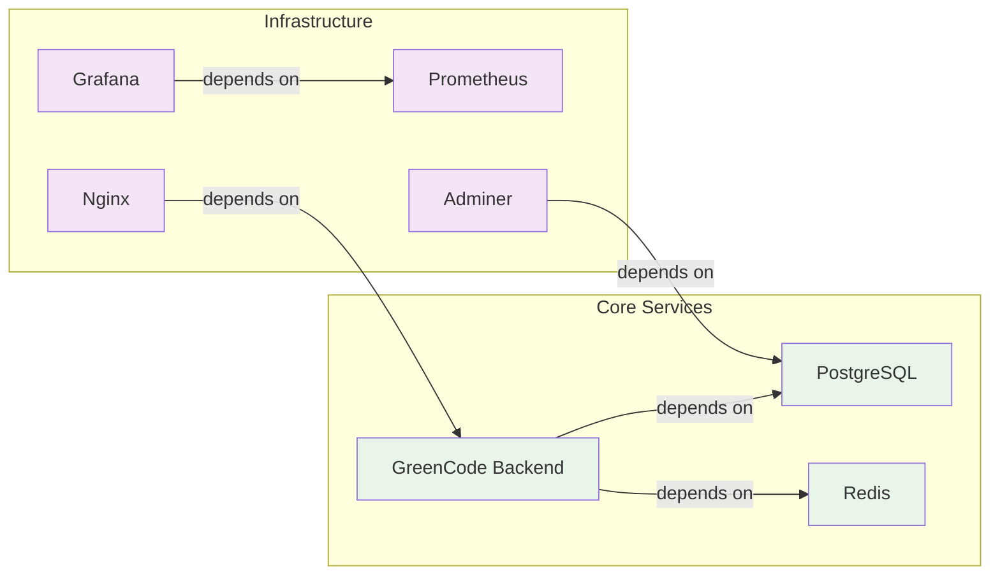

# System Overview Architecture

## High-Level System Architecture

```mermaid
graph TB
    subgraph "Client Layer"
        WEB[Web Application]
        MOBILE[Mobile App]
        API_CLIENT[API Clients]
    end
    
    subgraph "Load Balancer & Proxy"
        NGINX[Nginx Reverse Proxy<br/>Port 80/443]
    end
    
    subgraph "Application Layer"
        BACKEND[GreenCode Backend<br/>Spring Boot<br/>Port 8080]
    end
    
    subgraph "Data Layer"
        POSTGRES[(PostgreSQL<br/>Port 5432)]
        REDIS[(Redis Cache<br/>Port 6379)]
    end
    
    subgraph "Monitoring Stack"
        PROMETHEUS[Prometheus<br/>Port 9090]
        GRAFANA[Grafana<br/>Port 3000]
    end
    
    subgraph "Management Tools"
        ADMINER[Adminer<br/>Port 8081]
    end
    
    WEB --> NGINX
    MOBILE --> NGINX
    API_CLIENT --> NGINX
    
    NGINX --> BACKEND
    
    BACKEND --> POSTGRES
    BACKEND --> REDIS
    
    BACKEND --> PROMETHEUS
    PROMETHEUS --> GRAFANA
    
    ADMINER --> POSTGRES
    
    classDef client fill:#e1f5fe
    classDef proxy fill:#f3e5f5
    classDef app fill:#e8f5e8
    classDef data fill:#fff3e0
    classDef monitor fill:#fce4ec
    classDef tools fill:#f1f8e9
    
    class WEB,MOBILE,API_CLIENT client
    class NGINX proxy
    class BACKEND app
    class POSTGRES,REDIS data
    class PROMETHEUS,GRAFANA monitor
    class ADMINER tools
```

## Component Interaction Flow

```mermaid
sequenceDiagram
    participant Client
    participant Nginx
    participant Backend
    participant Redis
    participant PostgreSQL
    
    Client->>Nginx: HTTP Request
    Nginx->>Backend: Forward Request
    Backend->>Redis: Check Cache
    alt Cache Hit
        Redis-->>Backend: Return Cached Data
    else Cache Miss
        Backend->>PostgreSQL: Query Database
        PostgreSQL-->>Backend: Return Data
        Backend->>Redis: Update Cache
    end
    Backend-->>Nginx: JSON Response
    Nginx-->>Client: HTTP Response
```

## Service Dependencies

```mermaid
graph LR
    subgraph "Core Services"
        BACKEND[GreenCode Backend]
        POSTGRES[PostgreSQL]
        REDIS[Redis]
    end
    
    subgraph "Infrastructure"
        NGINX[Nginx]
        PROMETHEUS[Prometheus]
        GRAFANA[Grafana]
        ADMINER[Adminer]
    end
    
    BACKEND -->|depends on| POSTGRES
    BACKEND -->|depends on| REDIS
    NGINX -->|depends on| BACKEND
    GRAFANA -->|depends on| PROMETHEUS
    ADMINER -->|depends on| POSTGRES
    
    classDef core fill:#e8f5e8
    classDef infra fill:#f3e5f5
    
    class BACKEND,POSTGRES,REDIS core
    class NGINX,PROMETHEUS,GRAFANA,ADMINER infra
```
